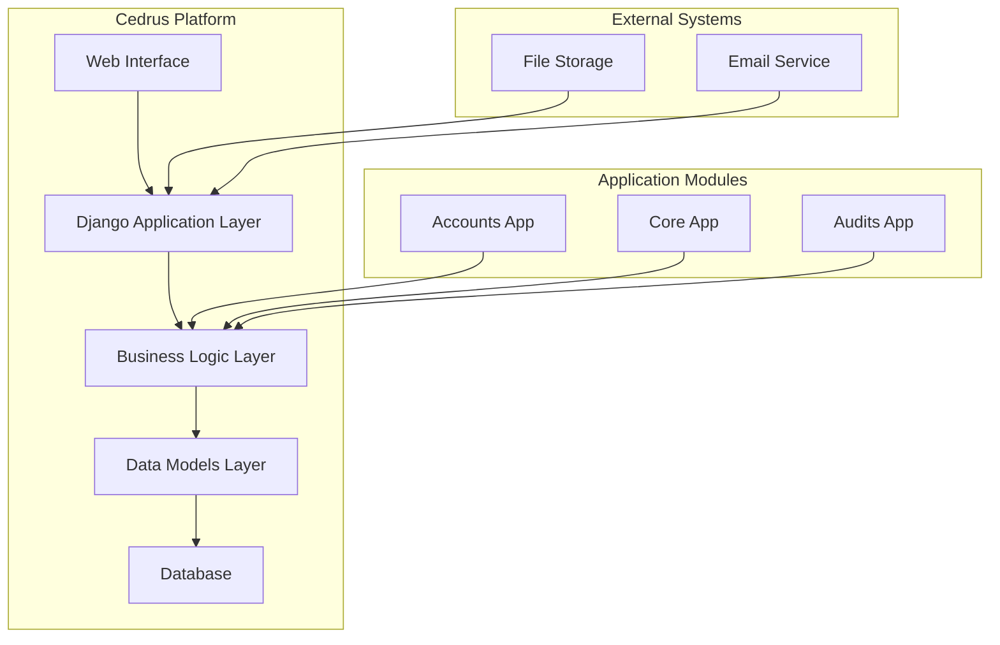
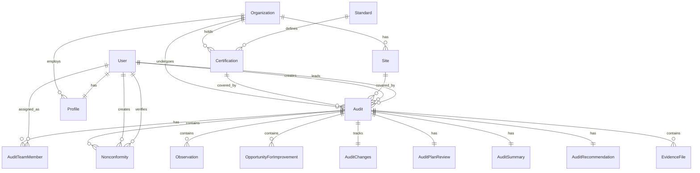
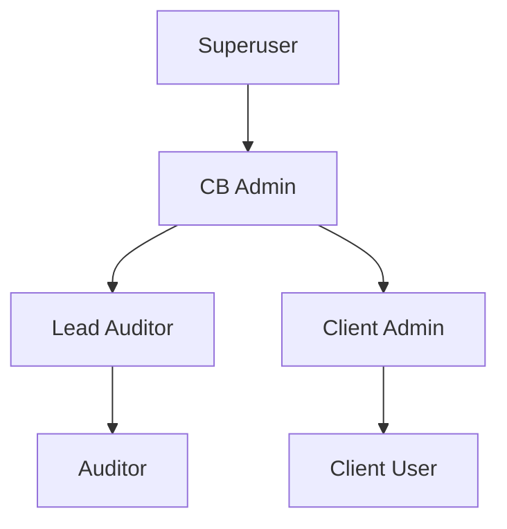
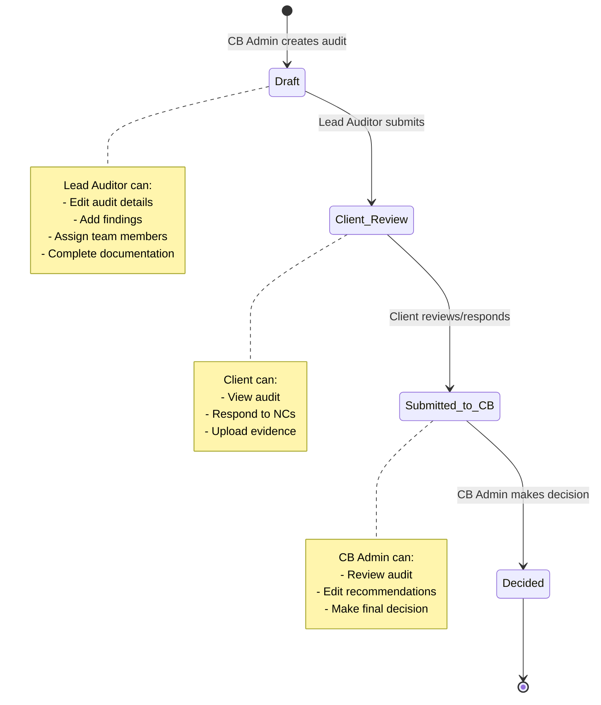
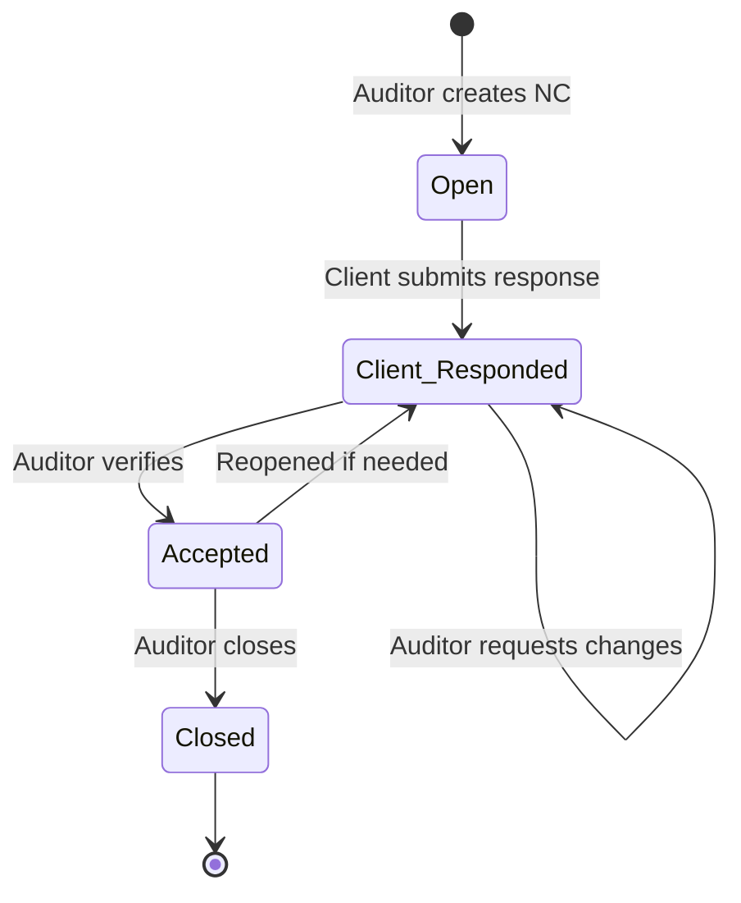

# Cedrus - Audit, Compliance, Risk & Governance Platform

**Cedrus** is an enterprise-grade Django-based platform for managing audits, compliance, risk, and governance. It serves as a comprehensive alternative to commercial certification body portals (such as DNV, LRQA, TÜV, Bureau Veritas) while remaining open-source and customizable.

## Table of Contents

- [Overview](#overview)
- [Key Features](#key-features)
- [Architecture](#architecture)
- [Technology Stack](#technology-stack)
- [Installation & Setup](#installation--setup)
- [User Roles & Permissions](#user-roles--permissions)
- [Core Workflows](#core-workflows)
- [System Components](#system-components)
- [API & Models Documentation](#api--models-documentation)
- [Development Guidelines](#development-guidelines)
- [Deployment](#deployment)
- [Contributing](#contributing)
- [License](#license)

---

## Overview

Cedrus is designed to support the complete audit lifecycle for certification bodies, accreditation bodies, and organizations managing their own HSEQ (Health, Safety, Environment, Quality) programs. The platform facilitates:

- **Audit Management**: Complete audit lifecycle from planning to certification decision
- **Finding Management**: Nonconformities, observations, and opportunities for improvement
- **Compliance Tracking**: Standards, certifications, and regulatory compliance
- **Multi-tenant Architecture**: Support for multiple organizations, sites, and certification bodies
- **Role-based Access Control**: Granular permissions for different user types

### Target Users

- **Certification Bodies (CBs)**: Manage client audits, certifications, and compliance
- **Accreditation Bodies**: Oversee certification body operations
- **Auditors**: Lead and support audit teams, document findings
- **Client Organizations**: Respond to findings, track certifications, manage compliance
- **Internal HSEQ Departments**: Manage internal audits and compliance programs

---

## Key Features

### For Certification Body Administrators

- **Organization Management**: Create and manage client organizations, sites, and contact information
- **Standards & Certifications**: Maintain standards library and track active certifications
- **Audit Oversight**: Create audits, assign lead auditors, and make final certification decisions
- **Recommendation Management**: Review and edit audit recommendations before final decisions
- **System Administration**: User management, role assignment, and system configuration

### For Auditors

- **Audit Management**: View and manage assigned audits (lead auditors can edit)
- **Finding Documentation**: Add nonconformities, observations, and opportunities for improvement
- **Team Collaboration**: Assign team members (internal and external) to audits
- **Workflow Management**: Update audit status through the approval workflow
- **Evidence Management**: Upload and attach evidence files to audits and findings

### For Client Organizations

- **Audit Visibility**: View all audits for their organization
- **Finding Response**: Respond to nonconformities with root cause analysis, corrections, and corrective actions
- **Evidence Submission**: Upload evidence files supporting corrective actions
- **Certification Tracking**: View active certifications, expiry dates, and status
- **Report Access**: Access audit reports and certification documents

---

## Architecture

### System Architecture



### Application Structure

```
cedrus/
├── accounts/          # User management, authentication, profiles, roles
├── core/              # Organizations, sites, standards, certifications
├── audits/            # Audit management, findings, recommendations
├── cedrus/            # Project settings, URL configuration
├── templates/         # Django templates (HTML)
├── static/            # CSS, JavaScript, static assets
└── media/             # Uploaded files (evidence, documents)
```

### Data Model Relationships



---

## Technology Stack

### Backend

- **Framework**: Django 5.x (monolithic architecture)
- **Database**: SQLite (development) / PostgreSQL (production recommended)
- **Authentication**: Django's built-in authentication system
- **Authorization**: Django Groups and Permissions

### Frontend

- **Templates**: Django template engine (server-side rendering)
- **CSS Framework**: Bootstrap 5
- **JavaScript**: Vanilla JavaScript (minimal, progressive enhancement)
- **No SPA**: Traditional multi-page application (no React/Vue/Angular)

### Development Tools

- **Python**: 3.8+
- **Package Management**: pip
- **Version Control**: Git

### Production Considerations

- **Web Server**: Gunicorn or uWSGI
- **Reverse Proxy**: Nginx
- **Database**: PostgreSQL (recommended for production)
- **File Storage**: Local filesystem or cloud storage (S3, Azure Blob, etc.)
- **Email**: SMTP server for notifications (future)

---

## Installation & Setup

### Prerequisites

- Python 3.8 or higher
- pip (Python package manager)
- Virtual environment tool (venv or virtualenv)

### Quick Start

#### 1. Clone the Repository

```bash
git clone <repository-url>
cd cedrus
```

#### 2. Install uv and Sync Dependencies

This project uses `uv` for dependency management.

```bash
# Install uv (if not already installed)
curl -LsSf https://astral.sh/uv/install.sh | sh

# Sync dependencies (creates virtual environment automatically)
uv sync
```

#### 3. Configure Database

```bash
# Create migrations
uv run manage.py makemigrations

# Apply migrations
uv run manage.py migrate
```

#### 4. Create Superuser

```bash
uv run manage.py createsuperuser
```

Follow the prompts to create an administrator account.

#### 5. Seed Initial Data (Optional)

```bash
uv run manage.py seed_data
```

This command creates:

- User groups (cb_admin, lead_auditor, auditor, client_admin, client_user)
- Sample users for each role
- Sample organization, site, standard, and certification
- Sample audit in "draft" status

**Default Test Credentials** (after seeding):

- **CB Admin**: `cbadmin` / `password123`
- **Lead Auditor**: `auditor1` / `password123`
- **Client Admin**: `clientadmin` / `password123`

⚠️ **Security Warning**: Change all default passwords in production!

#### 6. Run Development Server

```bash
uv run manage.py runserver
```

Visit `http://127.0.0.1:8000/` in your browser.

### Production Setup

See [DEPLOYMENT.md](docs/DEPLOYMENT.md) for detailed production deployment instructions.

---

## User Roles & Permissions

Cedrus uses Django's Group system for role-based access control. Each user belongs to one or more groups, which determine their permissions and dashboard access.

### Role Hierarchy



### Role Definitions

#### Certification Body Administrator (`cb_admin`)

**Responsibilities:**

- Manage all organizations, sites, standards, and certifications
- Create audits and assign lead auditors
- View all audits across all organizations
- Make final certification decisions
- Edit audit recommendations
- Manage user accounts and role assignments

**Permissions:**

- Full access to all core entities (organizations, sites, standards, certifications)
- Create, read, update, delete audits
- Edit audit recommendations
- Access Django admin interface

#### Lead Auditor (`lead_auditor`)

**Responsibilities:**

- Manage assigned audits (edit details, update status)
- Add findings (nonconformities, observations, OFIs)
- Assign team members to audits
- Complete audit documentation (changes, plan review, summary)
- Submit audits for CB review

**Permissions:**

- Read/update assigned audits (where user is lead_auditor)
- Create findings for assigned audits
- Update audit status (within workflow)
- Upload evidence files

#### Auditor (`auditor`)

**Responsibilities:**

- View assigned audits (as team member)
- Add findings to assigned audits
- Contribute to audit documentation
- Upload evidence files

**Permissions:**

- Read assigned audits (where user is team member)
- Create findings for assigned audits
- Upload evidence files

#### Client Administrator (`client_admin`)

**Responsibilities:**

- View all audits for their organization
- Respond to nonconformities
- Upload evidence files
- Manage client user accounts (future)

**Permissions:**

- Read audits for their organization
- Update nonconformity responses (root cause, correction, corrective action)
- Upload evidence files

#### Client User (`client_user`)

**Responsibilities:**

- View audits for their organization
- Respond to nonconformities
- Upload evidence files

**Permissions:**

- Read audits for their organization
- Update nonconformity responses
- Upload evidence files

### Permission Matrix

| Action | CB Admin | Lead Auditor | Auditor | Client Admin | Client User |
|--------|----------|--------------|---------|--------------|-------------|
| View all audits | ✅ | ❌ | ❌ | ❌ | ❌ |
| View assigned audits | ✅ | ✅ | ✅ | ❌ | ❌ |
| View org audits | ❌ | ❌ | ❌ | ✅ | ✅ |
| Create audits | ✅ | ❌ | ❌ | ❌ | ❌ |
| Edit audit details | ✅ | ✅* | ❌ | ❌ | ❌ |
| Add findings | ✅ | ✅* | ✅* | ❌ | ❌ |
| Edit recommendations | ✅ | ❌ | ❌ | ❌ | ❌ |
| Respond to NCs | ❌ | ❌ | ❌ | ✅ | ✅ |
| Upload evidence | ✅ | ✅* | ✅* | ✅ | ✅ |

*Only for assigned audits

---

## Core Workflows

### Audit Lifecycle Workflow



### Nonconformity Management Workflow



### Finding Types

Cedrus supports three types of audit findings:

1. **Nonconformity (NC)**
   - Major or Minor
   - Requires corrective action
   - Client must respond with root cause, correction, and corrective action
   - Auditor verifies the response

2. **Observation**
   - Informational finding
   - No action required
   - Documented for reference

3. **Opportunity for Improvement (OFI)**
   - Suggestion for enhancement
   - Optional action by client
   - Not a requirement

---

## System Components

### Accounts App (`accounts/`)

**Purpose**: User authentication, authorization, and profile management.

**Key Models:**

- `Profile`: Extended user profile with organization membership
- Uses Django's built-in `User` and `Group` models

**Key Views:**

- `CustomLoginView`: Authentication
- `dashboard`: Role-based dashboard routing
- `dashboard_cb`, `dashboard_auditor`, `dashboard_client`: Role-specific dashboards

**URLs:**

- `/login/` - User login
- `/logout/` - User logout
- `/dashboard/` - Main dashboard (redirects by role)

### Core App (`core/`)

**Purpose**: Foundation entities - organizations, sites, standards, and certifications.

**Key Models:**

- `Organization`: Client organizations (companies)
- `Site`: Physical locations belonging to organizations
- `Standard`: Management system standards (ISO 9001, ISO 14001, etc.)
- `Certification`: Certifications held by organizations

**Key Features:**

- Organization management with contact information
- Multi-site support per organization
- Standards library management
- Certification lifecycle tracking (draft, active, suspended, withdrawn, expired)

**URLs:**

- `/core/organizations/` - List/create organizations
- `/core/sites/` - List/create sites
- `/core/standards/` - List/create standards
- `/core/certifications/` - List/create certifications

### Audits App (`audits/`)

**Purpose**: Complete audit management, findings, and recommendations.

**Key Models:**

- `Audit`: Main audit record
- `AuditTeamMember`: Team members assigned to audits
- `AuditChanges`: Track organization changes during audit
- `AuditPlanReview`: Review of audit plan and deviations
- `AuditSummary`: Summary and evaluation of audit
- `Nonconformity`: Nonconformity findings (inherits from `Finding`)
- `Observation`: Observation findings (inherits from `Finding`)
- `OpportunityForImprovement`: OFI findings (inherits from `Finding`)
- `AuditRecommendation`: Final recommendations for CB decision
- `EvidenceFile`: File attachments for audits and findings

**Key Features:**

- Complete audit lifecycle management
- Multiple audit types (Stage 1, Stage 2, Surveillance, Recertification, Transfer, Special)
- Finding management with client response workflow
- Evidence file uploads
- Print-friendly audit reports

**URLs:**

- `/audits/` - List audits (filtered by role)
- `/audits/create/` - Create new audit (CB Admin only)
- `/audits/<id>/` - View audit details
- `/audits/<id>/edit/` - Edit audit (CB Admin or Lead Auditor)
- `/audits/<id>/print/` - Print-friendly view

---

## API & Models Documentation

### Core Models

#### Organization

Represents a client organization (company) that can be certified.

**Fields:**

- `name` (CharField): Official company name
- `registered_id` (CharField): Company registration number
- `registered_address` (TextField): Registered business address
- `customer_id` (CharField, unique): Internal customer reference number
- `total_employee_count` (PositiveIntegerField): Total employees across all sites
- `contact_telephone`, `contact_fax`, `contact_email`, `contact_website`: Contact information
- `signatory_name`, `signatory_title`: Authorized signatory
- `ms_representative_name`, `ms_representative_title`: Management System Representative
- `created_at`, `updated_at`: Timestamps

#### Site

Physical location or site belonging to an organization.

**Fields:**

- `organization` (ForeignKey): Parent organization
- `site_name` (CharField): Name of the site/location
- `site_address` (TextField): Physical address
- `site_employee_count` (PositiveIntegerField, optional): Employees at this site
- `site_scope_override` (TextField, optional): Site-specific scope description
- `active` (BooleanField): Whether site is currently active

#### Standard

Management system standard (e.g., ISO 9001:2015, ISO 14001:2015).

**Fields:**

- `code` (CharField, unique): Standard code (e.g., "ISO 9001:2015")
- `title` (CharField): Full title of the standard
- `nace_code` (CharField, optional): NACE classification code
- `ea_code` (CharField, optional): EA (European Accreditation) code

#### Certification

Certification held by an organization for a specific standard.

**Fields:**

- `organization` (ForeignKey): Organization holding the certification
- `standard` (ForeignKey): Standard being certified
- `certification_scope` (TextField): Scope of the certification
- `certificate_id` (CharField, optional): Certificate number/reference
- `certificate_status` (CharField): draft, active, suspended, withdrawn, expired
- `issue_date` (DateField, optional): Certificate issue date
- `expiry_date` (DateField, optional): Certificate expiry date

### Audit Models

#### Audit

Main audit record linking organization, certifications, sites, and team.

**Fields:**

- `organization` (ForeignKey): Organization being audited
- `certifications` (ManyToMany): Certifications covered by this audit
- `sites` (ManyToMany): Sites covered by this audit
- `audit_type` (CharField): stage1, stage2, surveillance, recertification, transfer, special
- `total_audit_date_from`, `total_audit_date_to` (DateField): Audit date range
- `audit_duration_hours` (FloatField): Total audit duration in hours
- `status` (CharField): draft, client_review, submitted_to_cb, decided
- `created_by` (ForeignKey): User who created the audit
- `lead_auditor` (ForeignKey): Lead auditor responsible for the audit

#### Nonconformity

Nonconformity finding requiring corrective action.

**Fields (inherited from Finding):**

- `audit` (ForeignKey): Related audit
- `standard` (ForeignKey, optional): Standard clause reference
- `clause` (CharField): Clause reference (e.g., "4.1", "7.5.1")
- `created_by` (ForeignKey): User who created the finding

**Fields (specific):**

- `category` (CharField): major or minor
- `objective_evidence` (TextField): Objective evidence of the NC
- `statement_of_nc` (TextField): Statement of the nonconformity
- `auditor_explanation` (TextField): Auditor's explanation
- `client_root_cause` (TextField): Client's root cause analysis
- `client_correction` (TextField): Client's immediate correction
- `client_corrective_action` (TextField): Client's corrective action plan
- `due_date` (DateField, optional): Due date for corrective action
- `verification_status` (CharField): open, client_responded, accepted, closed
- `verified_by` (ForeignKey, optional): User who verified the response
- `verified_at` (DateTimeField, optional): Verification timestamp

For complete model documentation, see [MODELS.md](docs/MODELS.md).

---

## Development Guidelines

### Code Style

- **Clarity over cleverness**: The codebase favors readable, maintainable code
- **Django best practices**: Follow Django conventions and patterns
- **Documentation**: All models include docstrings explaining their purpose
- **Type hints**: Consider adding type hints for complex functions (future enhancement)

### Project Structure

```
cedrus/
├── accounts/              # User management app
│   ├── models.py         # Profile model
│   ├── views.py          # Authentication and dashboards
│   ├── urls.py           # URL routing
│   └── management/       # Custom management commands
│       └── commands/
│           └── seed_data.py
├── core/                 # Core entities app
│   ├── models.py         # Organization, Site, Standard, Certification
│   ├── views.py          # CRUD views
│   └── urls.py
├── audits/               # Audit management app
│   ├── models.py         # Audit, Findings, Recommendations
│   ├── views.py          # Audit views and workflows
│   └── urls.py
├── cedrus/               # Project configuration
│   ├── settings.py       # Django settings
│   └── urls.py           # Root URL configuration
├── templates/            # Django templates
│   ├── base.html         # Base template
│   ├── accounts/         # Account templates
│   ├── audits/           # Audit templates
│   └── core/             # Core entity templates
├── static/               # Static files
│   └── css/
│       └── cedrus.css    # Custom styles
└── media/                # Uploaded files (gitignored)
```

### Adding New Features

1. **Create migrations** for model changes:

   ```bash
   python manage.py makemigrations
   python manage.py migrate
   ```

2. **Update admin** if needed (`admin.py` files)

3. **Add views** following existing patterns (class-based views preferred)

4. **Create templates** using Bootstrap 5 components

5. **Update URLs** in app's `urls.py` and root `urls.py` if needed

6. **Test** with different user roles

### Testing

Currently, the project uses `pytest` for testing.

**Current Status:**

- 500+ total tests
- 83% test coverage
- Comprehensive test suite for models, views, workflows, and validation

**Run Tests:**

```bash
# Run all tests (ensure development settings are used)
DJANGO_SETTINGS_MODULE=cedrus.settings uv run pytest

# Run specific app tests
DJANGO_SETTINGS_MODULE=cedrus.settings uv run pytest audits/
DJANGO_SETTINGS_MODULE=cedrus.settings uv run pytest core/
DJANGO_SETTINGS_MODULE=cedrus.settings uv run pytest accounts/

# Run with coverage
DJANGO_SETTINGS_MODULE=cedrus.settings uv run pytest --cov=. --cov-report=html
open htmlcov/index.html
```

**Test Coverage Highlights:**

- Core models: 100% coverage
- Audit models: 95% coverage
- Service layer: 92% coverage
- Forms: 75%+ coverage

---

## Security

### Security Grade: A- (Production-Ready)

Cedrus has undergone comprehensive security auditing with **zero high-severity vulnerabilities**.

**Security Features:**

- ✅ SQL injection protection (ORM-only queries)
- ✅ CSRF protection on all forms
- ✅ Secure file uploads (10MB limit, extension whitelist)
- ✅ Strong authentication and authorization
- ✅ Role-based access control
- ✅ 7 comprehensive data validation rules

### Production Security Checklist

**Critical (Required):**

- [ ] Set `DEBUG = False` in production
- [ ] Configure `ALLOWED_HOSTS` with your domain(s)
- [ ] Set secure `SECRET_KEY` from environment variable

  ```bash
  # Generate a new secret key:
  python -c 'from django.core.management.utils import get_random_secret_key; print(get_random_secret_key())'
  ```

**HTTPS/SSL Settings (Required for production):**

- [ ] Enable `SESSION_COOKIE_SECURE = True`
- [ ] Enable `CSRF_COOKIE_SECURE = True`
- [ ] Enable `SECURE_SSL_REDIRECT = True`
- [ ] Configure `SECURE_HSTS_SECONDS = 31536000` (1 year)

**Recommended:**

- [ ] Use PostgreSQL database (not SQLite)
- [ ] Configure static files serving (WhiteNoise or Nginx)
- [ ] Set up media file storage (local or cloud)
- [ ] Configure email backend for notifications
- [ ] Set up SSL/TLS certificates (Let's Encrypt)
- [ ] Configure backup strategy
- [ ] Set up monitoring and logging (Sentry)

### Quick Security Check

```bash
# Run Django's deployment security check
python manage.py check --deploy

# Run Bandit security scanner
bandit -r . -x ./venv,./htmlcov

# View comprehensive security audit
cat docs/SECURITY_AUDIT_REPORT.md
```

### Production Settings Template

A production-ready settings file is provided at `cedrus/settings_production.py` with all security headers configured. See `.env.example` for required environment variables.

**For more details, see:**

- [SECURITY_AUDIT_REPORT.md](docs/SECURITY_AUDIT_REPORT.md) - Comprehensive security analysis
- [CODE_QUALITY.md](docs/CODE_QUALITY.md#security-best-practices) - Security standards

---

## Deployment

### Production Stack Requirements

**Recommended:**

- **Web Server**: Gunicorn or uWSGI
- **Reverse Proxy**: Nginx or Apache
- **Database**: PostgreSQL 12+
- **File Storage**: Cloud storage (AWS S3, Azure Blob, etc.)
- **Process Manager**: systemd or supervisor
- **Monitoring**: Sentry, New Relic, or Datadog
- **SSL**: Let's Encrypt or commercial certificate

### Recommended Production Stack

- **Web Server**: Gunicorn or uWSGI
- **Reverse Proxy**: Nginx
- **Database**: PostgreSQL
- **File Storage**: Cloud storage (AWS S3, Azure Blob, etc.)
- **Process Manager**: systemd or supervisor
- **Monitoring**: Sentry, New Relic, or similar

See [DEPLOYMENT.md](docs/DEPLOYMENT.md) for detailed deployment instructions.

---

## Contributing

We welcome contributions! Please see [CONTRIBUTING.md](CONTRIBUTING.md) for guidelines on:

- Code of conduct
- Development setup
- Pull request process
- Coding standards
- Documentation requirements

### Planned Enhancements

- `risks/` app for risk management
- `internal_audits/` app for internal audit tracking
- Enhanced file upload and management
- Email notifications
- PDF report generation
- REST API endpoints
- Advanced reporting and analytics
- Multi-language support
- Audit scheduling and calendar integration

---

## License

MIT License - See LICENSE file for details.

---

## Support & Documentation

- **User Guides**: See `docs/user-guides/` for role-specific guides
- **API Documentation**: See `docs/API.md` (when available)
- **Architecture Documentation**: See `docs/ARCHITECTURE.md`
- **Release Notes**: See `CHANGELOG.md`

---

## Acknowledgments

Cedrus is designed to serve certification bodies, accreditation bodies, and organizations managing compliance and governance programs. We aim to provide enterprise-quality functionality while remaining open-source and accessible.

---

**Version**: 1.0.0  
**Last Updated**: 2024
