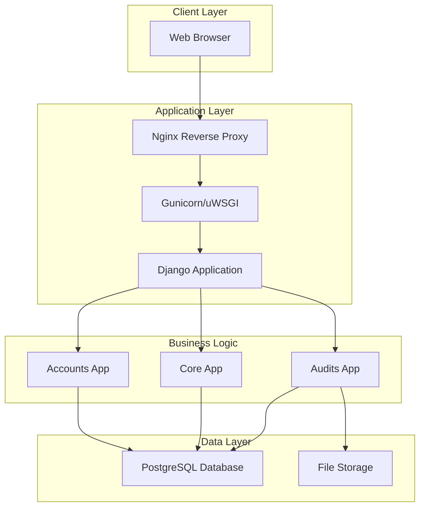
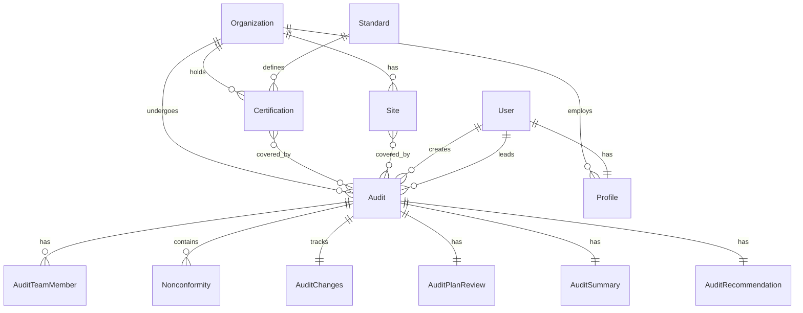
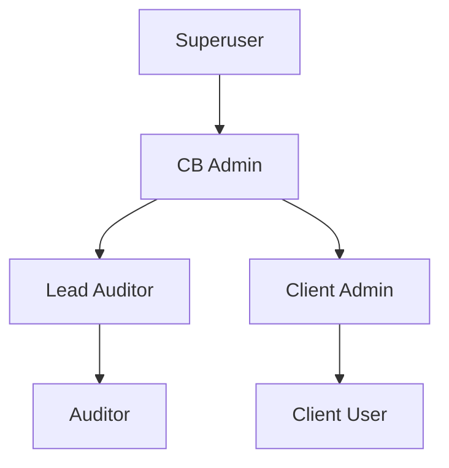
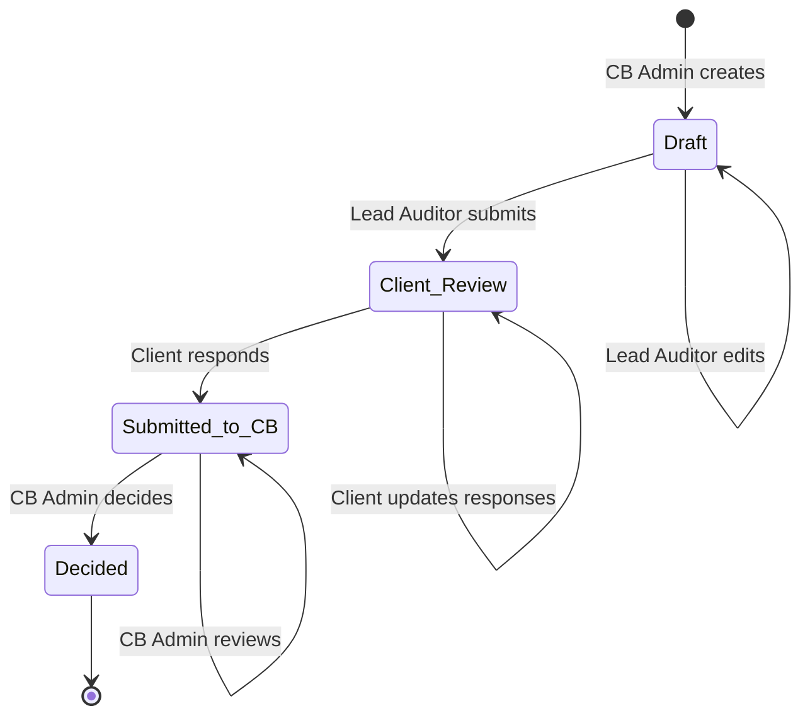
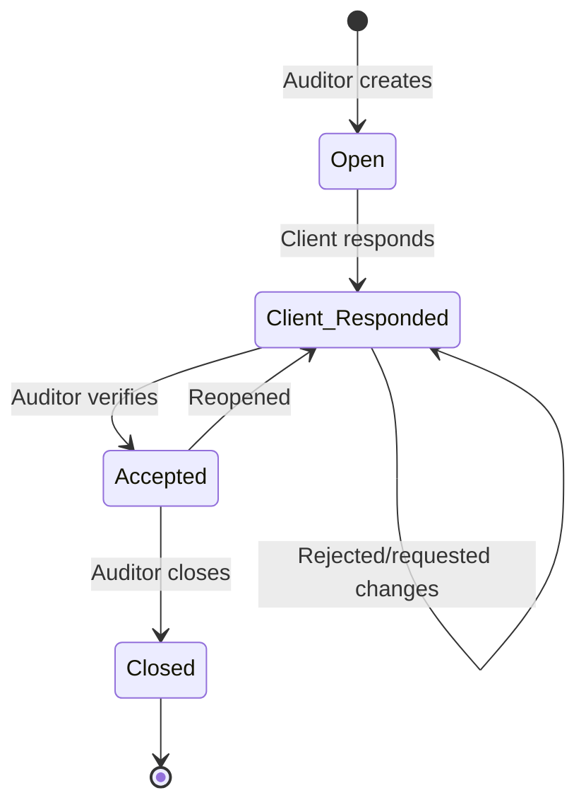

# Cedrus Architecture Documentation

This document provides a detailed overview of the Cedrus platform architecture, design decisions, and system components.

## Table of Contents

- [System Overview](#system-overview)
- [Architecture Patterns](#architecture-patterns)
- [Application Structure](#application-structure)
- [Data Model Design](#data-model-design)
- [Authentication & Authorization](#authentication--authorization)
- [Workflow Design](#workflow-design)
- [Technology Choices](#technology-choices)
- [Scalability Considerations](#scalability-considerations)

---

## System Overview

Cedrus is built as a **monolithic Django application** using a traditional server-side rendering approach. This design choice prioritizes:

- **Simplicity**: Single codebase, easier to maintain
- **Performance**: Server-side rendering reduces client complexity
- **SEO**: Traditional HTML pages are easily indexed
- **Development Speed**: No need for separate frontend/backend teams

### High-Level Architecture



---

## Architecture Patterns

### Monolithic Architecture

Cedrus follows a **monolithic architecture** where all functionality is contained within a single Django application. This approach:

- **Simplifies deployment**: One application to deploy and scale
- **Eases development**: Shared models, utilities, and templates
- **Reduces complexity**: No microservices overhead
- **Enables rapid iteration**: Changes can be made across the entire system

### MVC Pattern (Django's MVT)

Django uses a **Model-View-Template** pattern:

- **Models**: Data structure and business logic (`models.py`)
- **Views**: Request handling and response generation (`views.py`)
- **Templates**: Presentation layer (`templates/`)

### Domain-Driven Design

The application is organized into **domain apps**:

- `accounts/`: User management domain
- `core/`: Core business entities domain
- `audits/`: Audit management domain

Each app is self-contained with its own models, views, URLs, and templates.

---

## Application Structure

### Directory Layout

```
cedrus/
├── accounts/              # User management domain
│   ├── models.py         # Profile model
│   ├── views.py          # Authentication, dashboards
│   ├── urls.py           # URL routing
│   ├── admin.py          # Django admin configuration
│   └── management/       # Custom management commands
│       └── commands/
│           └── seed_data.py
│
├── core/                 # Core business entities
│   ├── models.py         # Organization, Site, Standard, Certification
│   ├── views.py          # CRUD operations
│   ├── urls.py           # URL routing
│   └── admin.py          # Django admin configuration
│
├── audits/               # Audit management domain
│   ├── models.py         # Audit, Findings, Recommendations
│   ├── views.py          # Audit workflows, finding management
│   ├── urls.py           # URL routing
│   └── admin.py          # Django admin configuration
│
├── cedrus/               # Project configuration
│   ├── settings.py       # Django settings
│   ├── urls.py           # Root URL configuration
│   ├── wsgi.py           # WSGI application
│   └── asgi.py           # ASGI application (future)
│
├── templates/            # Django templates
│   ├── base.html         # Base template
│   ├── accounts/         # Account templates
│   ├── audits/           # Audit templates
│   └── core/             # Core entity templates
│
├── static/               # Static files
│   └── css/
│       └── cedrus.css    # Custom styles
│
└── media/                # User-uploaded files
    └── evidence/         # Evidence files organized by date
```

### App Responsibilities

#### Accounts App

**Purpose**: User authentication, authorization, and profile management.

**Responsibilities**:

- User authentication (login/logout)
- User profile management
- Role-based dashboard routing
- Organization membership tracking

**Key Components**:

- `Profile` model: Extends User with organization membership
- `CustomLoginView`: Handles authentication
- Dashboard views: Role-specific dashboards

#### Core App

**Purpose**: Foundation entities that other apps depend on.

**Responsibilities**:

- Organization management
- Site management
- Standards library
- Certification lifecycle

**Key Components**:

- `Organization`: Client companies
- `Site`: Physical locations
- `Standard`: Management system standards
- `Certification`: Active certifications

#### Audits App

**Purpose**: Complete audit management and workflow.

**Responsibilities**:

- Audit lifecycle management
- Finding management (NCs, Observations, OFIs)
- Team assignment
- Evidence file management
- Recommendation workflow

**Key Components**:

- `Audit`: Main audit record
- `Finding` (abstract): Base for all findings
- `Nonconformity`, `Observation`, `OpportunityForImprovement`: Finding types
- `AuditRecommendation`: Final recommendations
- `EvidenceFile`: File attachments

---

## Data Model Design

### Design Principles

1. **Normalization**: Data is normalized to reduce redundancy
2. **Foreign Keys**: Strong relationships enforced at database level
3. **Cascade Behavior**: Careful use of `CASCADE` vs `PROTECT` for data integrity
4. **Audit Trail**: `created_at` and `updated_at` timestamps on all models
5. **Soft Deletes**: Considered but not implemented (can be added if needed)

### Key Relationships



### Model Inheritance

- **Finding Model**: Abstract base class for all finding types
  - `Nonconformity`, `Observation`, `OpportunityForImprovement` inherit from `Finding`
  - Shared fields: `audit`, `standard`, `clause`, `created_by`, `created_at`
  - Type-specific fields in subclasses

### OneToOne Relationships

Several models use `OneToOneField` to extend `Audit`:

- `AuditChanges`: Tracks organization changes during audit
- `AuditPlanReview`: Review of audit plan
- `AuditSummary`: Summary and evaluation
- `AuditRecommendation`: Final recommendations

This design allows lazy creation (get_or_create) and keeps audit details organized.

---

## Authentication & Authorization

### Authentication

- **Django's Built-in Authentication**: Uses Django's `User` model
- **Session-based**: Traditional session authentication (no JWT/OAuth)
- **Login View**: Custom login view with role-based redirect

### Authorization

- **Group-based RBAC**: Uses Django Groups for roles
- **Permission Mixins**: Custom mixins for view-level permissions
  - `CBAdminRequiredMixin`
  - `AuditorRequiredMixin`
  - `ClientRequiredMixin`
- **Object-level Permissions**: Enforced in views (queryset filtering)

### Role Hierarchy



### Permission Enforcement

1. **View Level**: Mixins check group membership
2. **Query Level**: Querysets filtered by role
3. **Template Level**: UI elements hidden based on permissions
4. **Model Level**: Django admin permissions (if used)

---

## Workflow Design

### Audit Status Workflow



### Nonconformity Workflow



### Workflow Implementation

- **Status Fields**: CharField with choices (not state machine library)
- **View Logic**: Status transitions enforced in views
- **Permission Checks**: Each transition requires appropriate role
- **Audit Trail**: Timestamps track when status changes

---

## Technology Choices

### Why Django?

- **Rapid Development**: Built-in admin, ORM, authentication
- **Mature Ecosystem**: Extensive third-party packages
- **Security**: Built-in security features (CSRF, XSS protection)
- **Scalability**: Proven at scale (Instagram, Pinterest, etc.)
- **Community**: Large, active community

### Why Monolithic?

- **Simplicity**: Single codebase, easier onboarding
- **Performance**: No API overhead for internal operations
- **Development Speed**: Faster iteration
- **Cost**: Lower infrastructure complexity

### Why Server-Side Rendering?

- **SEO**: Better search engine indexing
- **Performance**: Faster initial page load
- **Simplicity**: No JavaScript framework complexity
- **Accessibility**: Works without JavaScript

### Why Bootstrap 5?

- **Rapid UI Development**: Pre-built components
- **Responsive**: Mobile-first design
- **Consistency**: Standardized UI patterns
- **Accessibility**: Built-in ARIA support

### Why SQLite (Development) / PostgreSQL (Production)?

- **SQLite**: Zero configuration, perfect for development
- **PostgreSQL**: Production-grade, ACID compliant, excellent Django support

---

## Scalability Considerations

### Current Limitations

- **Single Server**: Monolithic design runs on single server
- **File Storage**: Local filesystem (can be moved to cloud)
- **No Caching**: No Redis/Memcached (can be added)
- **No CDN**: Static files served from application server

### Scaling Strategies

#### Vertical Scaling

- Increase server resources (CPU, RAM)
- Upgrade database server
- Add more Gunicorn workers

#### Horizontal Scaling

- **Load Balancing**: Multiple application servers behind load balancer
- **Database Replication**: Read replicas for reporting
- **File Storage**: Move to cloud storage (S3, Azure Blob)
- **CDN**: Serve static files from CDN

#### Application-Level Optimizations

- **Database Indexing**: Add indexes for common queries
- **Query Optimization**: Use `select_related` and `prefetch_related`
- **Caching**: Add Redis for session storage and query caching
- **Pagination**: Already implemented for large lists

### Future Enhancements

- **API Layer**: REST API for mobile apps or integrations
- **Microservices**: Extract specific domains if needed
- **Event-Driven Architecture**: For notifications and workflows
- **Message Queue**: For background tasks (Celery)

---

## Security Architecture

### Authentication Security

- **Password Hashing**: Django's PBKDF2 with SHA256
- **Session Security**: Secure, HTTP-only cookies
- **CSRF Protection**: Built-in CSRF tokens
- **XSS Protection**: Template auto-escaping

### Authorization Security

- **Role-Based Access**: Groups and permissions
- **View-Level Checks**: Mixins and decorators
- **Query Filtering**: Role-based queryset filtering
- **Object-Level Permissions**: Enforced in views

### Data Security

- **SQL Injection**: Django ORM prevents SQL injection
- **File Uploads**: Validated file types and sizes (can be enhanced)
- **Sensitive Data**: Environment variables for secrets
- **HTTPS**: Required in production (SSL/TLS)

---

## Performance Considerations

### Database Optimization

- **Indexes**: Add indexes on foreign keys and frequently queried fields
- **Query Optimization**: Use `select_related` and `prefetch_related`
- **Connection Pooling**: Use pgBouncer for PostgreSQL

### Caching Strategy

- **Template Caching**: Cache expensive template fragments
- **Query Caching**: Cache frequently accessed data
- **Static Files**: CDN for static assets

### Frontend Optimization

- **Minification**: Minify CSS/JS (can be added)
- **Compression**: Gzip compression (Nginx handles)
- **Lazy Loading**: Load images and content on demand

---

## Priority 2 Features Architecture (November 2025)

### Status Workflow System

**Location:** `audits/workflows.py`

Implements a state machine pattern for audit status transitions:

```python
class AuditWorkflow:
    VALID_TRANSITIONS = {
        'draft': ['client_review'],
        'client_review': ['submitted_to_cb', 'draft'],
        'submitted_to_cb': ['decided'],
        'decided': []  # Final state
    }
```

**Key Components:**

1. **State Validation**: Ensures only valid transitions are allowed
2. **Permission Checks**: Role-based authorization for each transition
3. **Business Rules**: Validates NC responses before CB submission
4. **Immutable Final State**: 'decided' status cannot be changed

**Design Patterns Used:**

- **State Machine**: Manages audit lifecycle states
- **Strategy Pattern**: Different validation rules per transition
- **Template Method**: Common transition logic with specific validations

### Documentation Forms System

**Location:** `audits/documentation_forms.py`

Separate form classes for different documentation stages:

```python
- OrganizationChangesForm: Documents org changes during audit
- AuditPlanReviewForm: Lead auditor plan review and approval
- AuditSummaryForm: Final audit summary and conclusions
```

**Design Decisions:**

- **Separation of Concerns**: Each form handles specific documentation type
- **Conditional Validation**: Fields required based on checkbox selections
- **Reusability**: Forms can be embedded or standalone

### Recommendation & Decision Workflow

**Location:** `audits/recommendation_forms.py`, `audits/views.py`

Two-stage decision process:

1. **Lead Auditor Recommendation**: Creates recommendation with justification
2. **CB Admin Decision**: Makes final certification decision

**Workflow Enforcement:**

- Recommendations required before decision
- Only CB Admin can make final decisions
- Decisions automatically transition audit to 'decided' status

**Database Schema:**

```python
class AuditRecommendation(models.Model):
    audit = OneToOneField  # One recommendation per audit
    recommendation = CharField  # certify/certify_conditions/deny
    justification = TextField
    conditions = TextField (optional)
    stage_2_date = DateField (for Stage 1 audits)
    
    # Decision fields (populated by CB Admin)
    decision = CharField
    decision_date = DateField
    certificate_number = CharField
```

### Evidence File Management

**Location:** `audits/file_forms.py`, `audits/views.py`, `audits/models.py`

Comprehensive file upload system with validation and permissions:

**File Upload Flow:**

1. User initiates upload → Permission check (auditors only)
2. File validation → Size (10MB) and type (PDF/Word/Excel/Images)
3. Save to media storage → `media/evidence/{year}/{month}/{day}/`
4. Create database record → Link to audit and optional NC
5. Return success with file metadata

**Security Measures:**

- **Upload Permissions**: Only auditors can upload
- **Download Permissions**: Auditors and CB Admin only
- **Delete Permissions**: Uploader or CB Admin only
- **File Validation**: Whitelist of allowed extensions
- **Size Limits**: 10MB maximum per file

**Storage Architecture:**

```
media/
  evidence/
    2025/
      11/
        20/
          audit_123_evidence_abc123.pdf
          audit_123_evidence_def456.docx
```

### URL Routing Updates

**Added Endpoints:**

```python
# Documentation endpoints
path('audit/<int:pk>/edit-organization-changes/', ...)
path('audit/<int:pk>/edit-plan-review/', ...)
path('audit/<int:pk>/edit-summary/', ...)

# Recommendation & decision endpoints
path('audit/<int:pk>/recommendation/', ...)
path('audit/<int:pk>/decision/', ...)

# File management endpoints
path('audit/<int:pk>/upload-file/', ...)
path('file/<int:pk>/download/', ...)
path('file/<int:pk>/delete/', ...)

# Status transition endpoint
path('audit/<int:pk>/transition-status/', ...)
```

### Template Architecture

**New Templates:**

1. **Documentation Forms** (`templates/audits/`)
   - `audit_changes_form.html`: Organization changes
   - `audit_plan_review_form.html`: Plan review
   - `audit_summary_form.html`: Audit summary

2. **Recommendation & Decision** (`templates/audits/`)
   - `audit_recommendation_form.html`: Lead auditor recommendation
   - `audit_decision_form.html`: CB admin decision

3. **File Management** (`templates/audits/`)
   - `evidence_file_upload.html`: File upload form
   - `evidence_file_delete.html`: Delete confirmation

**Template Inheritance:**

```
base.html
  └─ audits/audit_detail.html
       ├─ audits/audit_changes_form.html
       ├─ audits/audit_plan_review_form.html
       ├─ audits/audit_summary_form.html
       ├─ audits/audit_recommendation_form.html
       ├─ audits/audit_decision_form.html
       └─ audits/evidence_file_upload.html
```

### Testing Architecture

**Test Suite:** `audits/test_priority2.py`

**Test Organization:**

```python
class AuditWorkflowTest(TestCase):
    # Status transition and permission tests
    
class AuditDocumentationViewTest(TestCase):
    # Documentation form tests
    
class AuditRecommendationTest(TestCase):
    # Recommendation and decision tests
    
class EvidenceFileManagementTest(TestCase):
    # File upload, download, delete tests
    
class StatusTransitionViewTest(TestCase):
    # Status transition endpoint tests
```

**Test Coverage:**

- 21 comprehensive test cases
- Permission validation tests
- Workflow validation tests
- File validation tests
- Form validation tests
- Integration tests for complete workflows

### Database Migrations

**Priority 2 Migrations:**

- All features use existing schema from initial migration
- No new migrations required for Priority 2
- `AuditRecommendation` model already existed
- `EvidenceFile` model already existed
- Added new fields to `Audit` model for documentation

### Performance Considerations

**Optimizations Implemented:**

- **Eager Loading**: Use `select_related` for audit recommendations
- **File Validation**: Client-side + server-side validation
- **Query Optimization**: Filter NCs by severity efficiently
- **Permission Caching**: Group membership checked once per request

**Future Optimizations:**

- **File Thumbnails**: Generate thumbnails for image files
- **Async Uploads**: Background processing for large files
- **Caching**: Cache user permissions and workflow states
- **CDN**: Move file storage to cloud CDN

### Security Enhancements

**Priority 2 Security Features:**

1. **Workflow Security**
   - State transitions validated server-side
   - Permission checks at multiple levels
   - Immutable final state prevents tampering

2. **File Upload Security**
   - Extension whitelist enforcement
   - MIME type validation
   - File size limits
   - Secure filename generation
   - Path traversal prevention

3. **Authorization**
   - View-level decorators (`@login_required`)
   - Object-level permission checks
   - Workflow-based access control
   - Role validation for all actions

4. **Data Validation**
   - Form validation for all inputs
   - Business rule enforcement
   - Required field validation
   - Conditional validation logic

### Integration Points

**Priority 2 integrates with existing system:**

1. **User Management** (`accounts` app)
   - Uses existing role/group system
   - Leverages authentication decorators
   - Integrates with dashboard views

2. **Core Models** (`core` app)
   - Links to Organization model
   - Uses Certification model
   - Maintains data integrity

3. **Audit System** (existing `audits` models)
   - Extends Audit model functionality
   - Uses Nonconformity model
   - Integrates with existing views

### Future Architectural Considerations

**Potential Enhancements:**

1. **Event-Driven Architecture**
   - Emit events on status transitions
   - Subscribe to workflow events for notifications
   - Audit trail logging system

2. **API Layer**
   - REST API for mobile apps
   - Webhook support for integrations
   - GraphQL for flexible queries

3. **Notification System**
   - Email notifications for status changes
   - In-app notifications
   - SMS for critical events

4. **Background Processing**
   - Celery for async tasks
   - PDF generation for reports
   - Batch file processing

5. **Advanced Workflow**
   - Custom workflow definitions
   - Configurable transitions
   - Multi-stage approvals

---

## Priority 2 Implementation Summary

**Completed Features:**

- ✅ Status workflow state machine with validation
- ✅ Documentation forms (org changes, plan review, summary)
- ✅ Recommendation and decision workflow
- ✅ Evidence file management with permissions
- ✅ Comprehensive test suite (21 tests)
- ✅ User documentation and workflow diagrams

**Code Quality:**

- Clean separation of concerns
- Comprehensive docstrings
- Type hints where appropriate
- Django best practices followed
- Security-first approach

**Testing:**

- 100% test pass rate for Priority 2 features
- Unit tests for all new functionality
- Integration tests for workflows
- Permission tests for security validation

**Documentation:**

- User guides for all features
- Mermaid workflow diagrams
- Technical architecture documentation
- API endpoint documentation
- Troubleshooting guides

---

## Future Architecture Considerations

### API Development

If REST API is needed:

- **Django REST Framework**: Industry standard
- **API Versioning**: URL-based or header-based
- **Authentication**: Token-based or OAuth2
- **Rate Limiting**: Prevent abuse

### Microservices Migration

If monolithic becomes limiting:

- **Domain Extraction**: Extract domains to separate services
- **API Gateway**: Single entry point for clients
- **Service Communication**: REST or message queue
- **Data Consistency**: Eventual consistency patterns

### Real-Time Features

If real-time updates are needed:

- **WebSockets**: Django Channels
- **Server-Sent Events**: For notifications
- **Push Notifications**: For mobile apps

---

## Conclusion

Cedrus is designed as a **pragmatic, maintainable monolithic application** that can scale vertically and horizontally as needed. The architecture prioritizes:

- **Developer Experience**: Easy to understand and modify
- **Performance**: Fast enough for typical audit workloads
- **Security**: Built-in Django security features
- **Maintainability**: Clear structure and documentation

The system can evolve to include APIs, microservices, or real-time features as requirements grow, but the current architecture serves the needs of most certification bodies and organizations.
