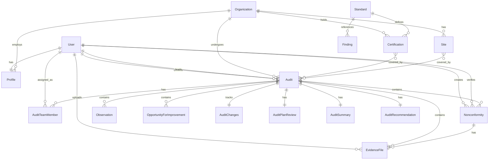

# Cedrus Models Documentation

Complete reference documentation for all data models in the Cedrus platform.

## Table of Contents

- [Accounts App Models](#accounts-app-models)
- [Core App Models](#core-app-models)
- [Audits App Models](#audits-app-models)
- [Model Relationships](#model-relationships)
- [Field Reference](#field-reference)

---

## Accounts App Models

### Profile

Extended user profile with organization membership.

**Location**: `accounts/models.py`

**Inherits**: `django.db.models.Model`

**Fields**:

| Field | Type | Description |
|-------|------|-------------|
| `user` | OneToOneField(User) | Django User instance |
| `organization` | ForeignKey(Organization, null=True) | Organization membership (null for CB admins/auditors) |

**Methods**:

- `is_cb_admin()`: Returns True if user is in cb_admin group
- `is_lead_auditor()`: Returns True if user is in lead_auditor group
- `is_auditor()`: Returns True if user is lead_auditor or auditor
- `is_client_admin()`: Returns True if user is in client_admin group
- `is_client_user()`: Returns True if user is client_admin or client_user
- `get_role_display()`: Returns human-readable role name

**Signals**:

- `post_save` on User: Automatically creates Profile when User is created

---

## Core App Models

### Organization

Client organization (company) that can be certified.

**Location**: `core/models.py`

**Fields**:

| Field | Type | Description |
|-------|------|-------------|
| `name` | CharField(255) | Official company name |
| `registered_id` | CharField(100, blank=True) | Company registration number |
| `registered_address` | TextField | Registered business address |
| `customer_id` | CharField(50, unique) | Internal customer reference number |
| `total_employee_count` | PositiveIntegerField | Total employees across all sites |
| `contact_telephone` | CharField(50, blank=True) | Contact telephone |
| `contact_fax` | CharField(50, blank=True) | Contact fax |
| `contact_email` | EmailField(blank=True) | Contact email |
| `contact_website` | URLField(blank=True) | Contact website |
| `signatory_name` | CharField(255, blank=True) | Authorized signatory name |
| `signatory_title` | CharField(255, blank=True) | Authorized signatory title |
| `ms_representative_name` | CharField(255, blank=True) | Management System Representative name |
| `ms_representative_title` | CharField(255, blank=True) | MS Representative title |
| `created_at` | DateTimeField(auto_now_add) | Creation timestamp |
| `updated_at` | DateTimeField(auto_now) | Last update timestamp |

**Relationships**:

- Has many `Site` objects (related_name: `sites`)
- Has many `Certification` objects (related_name: `certifications`)
- Has many `Audit` objects (related_name: `audits`)
- Has many `Profile` objects (related_name: `members`)

**Meta**:

- `verbose_name`: "Organization"
- `verbose_name_plural`: "Organizations"
- `ordering`: ["name"]

### Site

Physical location or site belonging to an organization.

**Location**: `core/models.py`

**Fields**:

| Field | Type | Description |
|-------|------|-------------|
| `organization` | ForeignKey(Organization) | Parent organization |
| `site_name` | CharField(255) | Name of the site/location |
| `site_address` | TextField | Physical address of the site |
| `site_employee_count` | PositiveIntegerField(null=True, blank=True) | Employees at this site |
| `site_scope_override` | TextField(blank=True) | Site-specific scope description |
| `active` | BooleanField(default=True) | Whether site is currently active |
| `created_at` | DateTimeField(auto_now_add) | Creation timestamp |
| `updated_at` | DateTimeField(auto_now) | Last update timestamp |

**Relationships**:

- Belongs to `Organization` (related_name: `sites`)
- Many-to-many with `Audit` (related_name: `audits`)

**Meta**:

- `verbose_name`: "Site"
- `verbose_name_plural`: "Sites"
- `ordering`: ["organization", "site_name"]

### Standard

Management system standard (e.g., ISO 9001:2015, ISO 14001:2015).

**Location**: `core/models.py`

**Fields**:

| Field | Type | Description |
|-------|------|-------------|
| `code` | CharField(100, unique) | Standard code (e.g., "ISO 9001:2015") |
| `title` | CharField(255) | Full title of the standard |
| `nace_code` | CharField(50, blank=True) | NACE classification code |
| `ea_code` | CharField(50, blank=True) | EA (European Accreditation) code |
| `created_at` | DateTimeField(auto_now_add) | Creation timestamp |
| `updated_at` | DateTimeField(auto_now) | Last update timestamp |

**Relationships**:

- Has many `Certification` objects (related_name: `certifications`)

**Meta**:

- `verbose_name`: "Standard"
- `verbose_name_plural`: "Standards"
- `ordering`: ["code"]

### Certification

Certification held by an organization for a specific standard.

**Location**: `core/models.py`

**Fields**:

| Field | Type | Description |
|-------|------|-------------|
| `organization` | ForeignKey(Organization) | Organization holding the certification |
| `standard` | ForeignKey(Standard) | Standard being certified |
| `certification_scope` | TextField | Scope of the certification |
| `certificate_id` | CharField(100, blank=True) | Certificate number/reference |
| `certificate_status` | CharField(20) | Status: draft, active, suspended, withdrawn, expired |
| `issue_date` | DateField(null=True, blank=True) | Certificate issue date |
| `expiry_date` | DateField(null=True, blank=True) | Certificate expiry date |
| `created_at` | DateTimeField(auto_now_add) | Creation timestamp |
| `updated_at` | DateTimeField(auto_now) | Last update timestamp |

**Status Choices**:

- `draft`: Draft certification
- `active`: Active certification
- `suspended`: Suspended certification
- `withdrawn`: Withdrawn certification
- `expired`: Expired certification

**Relationships**:

- Belongs to `Organization` (related_name: `certifications`)
- Belongs to `Standard` (related_name: `certifications`)
- Many-to-many with `Audit` (related_name: `audits`)

**Constraints**:

- `unique_together`: [["organization", "standard"]] - One certification per organization/standard pair

**Meta**:

- `verbose_name`: "Certification"
- `verbose_name_plural`: "Certifications"
- `ordering`: ["organization", "standard"]

---

## Audits App Models

### Audit

Main audit record linking organization, certifications, sites, and team.

**Location**: `audits/models.py`

**Fields**:

| Field | Type | Description |
|-------|------|-------------|
| `organization` | ForeignKey(Organization) | Organization being audited |
| `certifications` | ManyToManyField(Certification) | Certifications covered by this audit |
| `sites` | ManyToManyField(Site) | Sites covered by this audit |
| `audit_type` | CharField(20) | Type of audit |
| `total_audit_date_from` | DateField | Audit start date |
| `total_audit_date_to` | DateField | Audit end date |
| `audit_duration_hours` | FloatField | Total audit duration in hours |
| `status` | CharField(20) | Audit status |
| `created_by` | ForeignKey(User) | User who created the audit |
| `lead_auditor` | ForeignKey(User) | Lead auditor responsible for this audit |
| `created_at` | DateTimeField(auto_now_add) | Creation timestamp |
| `updated_at` | DateTimeField(auto_now) | Last update timestamp |

**Audit Type Choices**:

- `stage1`: Stage 1 audit
- `stage2`: Stage 2 audit
- `surveillance`: Surveillance audit
- `recertification`: Recertification audit
- `transfer`: Transfer audit
- `special`: Special audit

**Status Choices**:

- `draft`: Draft audit (being prepared)
- `client_review`: Client review (client can respond to findings)
- `submitted_to_cb`: Submitted to CB (awaiting CB decision)
- `decided`: Decided (final decision made)

**Relationships**:

- Belongs to `Organization` (related_name: `audits`)
- Many-to-many with `Certification` (related_name: `audits`)
- Many-to-many with `Site` (related_name: `audits`)
- Belongs to `User` (created_by, related_name: `audits_created`)
- Belongs to `User` (lead_auditor, related_name: `audits_led`)
- Has many `AuditTeamMember` objects (related_name: `team_members`)
- Has many `Nonconformity` objects (related_name: `nonconformity_set`)
- Has many `Observation` objects (related_name: `observation_set`)
- Has many `OpportunityForImprovement` objects (related_name: `opportunityforimprovement_set`)
- Has many `EvidenceFile` objects (related_name: `evidence_files`)
- One-to-one with `AuditChanges` (related_name: `changes`)
- One-to-one with `AuditPlanReview` (related_name: `plan_review`)
- One-to-one with `AuditSummary` (related_name: `summary`)
- One-to-one with `AuditRecommendation` (related_name: `recommendation`)

**Meta**:

- `verbose_name`: "Audit"
- `verbose_name_plural`: "Audits"
- `ordering`: ["-total_audit_date_from", "-created_at"]

### AuditTeamMember

Team member assigned to an audit.

**Location**: `audits/models.py`

**Fields**:

| Field | Type | Description |
|-------|------|-------------|
| `audit` | ForeignKey(Audit) | Related audit |
| `user` | ForeignKey(User, null=True, blank=True) | User account (null for external experts) |
| `name` | CharField(255) | Full name (required if user is null) |
| `title` | CharField(255, blank=True) | Job title or role |
| `role` | CharField(20) | Role in the audit team |
| `date_from` | DateField | Start date for this team member |
| `date_to` | DateField | End date for this team member |

**Role Choices**:

- `lead_auditor`: Lead Auditor
- `auditor`: Auditor
- `technical_expert`: Technical Expert
- `trainee`: Trainee
- `observer`: Observer

**Validation**:

- `clean()`: Ensures either `user` or `name` is provided

**Relationships**:

- Belongs to `Audit` (related_name: `team_members`)
- Belongs to `User` (optional, related_name: `audit_assignments`)

**Meta**:

- `verbose_name`: "Audit Team Member"
- `verbose_name_plural`: "Audit Team Members"
- `ordering`: ["audit", "role", "name"]

### AuditChanges

Track changes to organization details during the audit.

**Location**: `audits/models.py`

**One-to-one relationship with Audit**

**Fields**:

| Field | Type | Description |
|-------|------|-------------|
| `audit` | OneToOneField(Audit) | Related audit |
| `change_of_name` | BooleanField(default=False) | Change of organization name |
| `change_of_scope` | BooleanField(default=False) | Change of scope |
| `change_of_sites` | BooleanField(default=False) | Change of sites |
| `change_of_ms_rep` | BooleanField(default=False) | Change of MS Representative |
| `change_of_signatory` | BooleanField(default=False) | Change of signatory |
| `change_of_employee_count` | BooleanField(default=False) | Change of employee count |
| `change_of_contact_info` | BooleanField(default=False) | Change of contact information |
| `other_has_change` | BooleanField(default=False) | Other changes |
| `other_description` | TextField(blank=True) | Description of other changes |

**Meta**:

- `verbose_name`: "Audit Changes"
- `verbose_name_plural`: "Audit Changes"

### AuditPlanReview

Review of the audit plan and any deviations.

**Location**: `audits/models.py`

**One-to-one relationship with Audit**

**Fields**:

| Field | Type | Description |
|-------|------|-------------|
| `audit` | OneToOneField(Audit) | Related audit |
| `deviations_yes_no` | BooleanField(default=False) | Were there deviations from the audit plan? |
| `deviations_details` | TextField(blank=True) | Details of deviations |
| `issues_affecting_yes_no` | BooleanField(default=False) | Were there issues affecting the audit? |
| `issues_affecting_details` | TextField(blank=True) | Details of issues affecting the audit |
| `next_audit_date_from` | DateField(null=True, blank=True) | Proposed next audit start date |
| `next_audit_date_to` | DateField(null=True, blank=True) | Proposed next audit end date |

**Meta**:

- `verbose_name`: "Audit Plan Review"
- `verbose_name_plural`: "Audit Plan Reviews"

### AuditSummary

Summary and evaluation of the audit.

**Location**: `audits/models.py`

**One-to-one relationship with Audit**

**Fields**:

| Field | Type | Description |
|-------|------|-------------|
| `audit` | OneToOneField(Audit) | Related audit |
| `objectives_met` | BooleanField(default=False) | Audit objectives were met |
| `objectives_comments` | TextField(blank=True) | Comments on objectives |
| `scope_appropriate` | BooleanField(default=False) | Scope was appropriate |
| `scope_comments` | TextField(blank=True) | Comments on scope |
| `ms_meets_requirements` | BooleanField(default=False) | Management system meets requirements |
| `ms_comments` | TextField(blank=True) | Comments on MS requirements |
| `management_review_effective` | BooleanField(default=False) | Management review was effective |
| `management_review_comments` | TextField(blank=True) | Comments on management review |
| `internal_audit_effective` | BooleanField(default=False) | Internal audit was effective |
| `internal_audit_comments` | TextField(blank=True) | Comments on internal audit |
| `ms_effective` | BooleanField(default=False) | Management system is effective |
| `ms_effective_comments` | TextField(blank=True) | Comments on MS effectiveness |
| `correct_use_of_logos` | BooleanField(default=False) | Correct use of logos |
| `logos_comments` | TextField(blank=True) | Comments on logo use |
| `promoted_to_committee` | BooleanField(default=False) | Promoted to committee |
| `committee_comments` | TextField(blank=True) | Comments on committee promotion |
| `general_commentary` | TextField(blank=True) | General commentary (A.4) |

**Meta**:

- `verbose_name`: "Audit Summary"
- `verbose_name_plural`: "Audit Summaries"

### Finding (Abstract Base Model)

Abstract base model for audit findings.

**Location**: `audits/models.py`

**Abstract**: Yes (cannot be instantiated directly)

**Fields**:

| Field | Type | Description |
|-------|------|-------------|
| `audit` | ForeignKey(Audit) | Related audit |
| `standard` | ForeignKey(Standard, null=True, blank=True) | Standard clause this finding relates to |
| `clause` | CharField(100) | Clause reference (e.g., "4.1", "7.5.1") |
| `created_by` | ForeignKey(User) | User who created the finding |
| `created_at` | DateTimeField(auto_now_add) | Creation timestamp |

**Inherited By**:

- `Nonconformity`
- `Observation`
- `OpportunityForImprovement`

**Meta**:

- `abstract`: True
- `ordering`: ["clause", "created_at"]

### Nonconformity

Nonconformity finding requiring corrective action.

**Location**: `audits/models.py`

**Inherits**: `Finding`

**Fields** (inherited from Finding):

- `audit`, `standard`, `clause`, `created_by`, `created_at`

**Fields** (specific to Nonconformity):

| Field | Type | Description |
|-------|------|-------------|
| `category` | CharField(10) | Major or minor nonconformity |
| `objective_evidence` | TextField | Objective evidence of the NC |
| `statement_of_nc` | TextField | Statement of the nonconformity |
| `auditor_explanation` | TextField | Auditor's explanation |
| `client_root_cause` | TextField(blank=True) | Client's root cause analysis |
| `client_correction` | TextField(blank=True) | Client's immediate correction |
| `client_corrective_action` | TextField(blank=True) | Client's corrective action plan |
| `due_date` | DateField(null=True, blank=True) | Due date for corrective action |
| `verification_status` | CharField(20) | Verification status |
| `verified_by` | ForeignKey(User, null=True, blank=True) | User who verified the response |
| `verified_at` | DateTimeField(null=True, blank=True) | Verification timestamp |

**Category Choices**:

- `major`: Major nonconformity
- `minor`: Minor nonconformity

**Verification Status Choices**:

- `open`: Open (awaiting client response)
- `client_responded`: Client has responded
- `accepted`: Response accepted by auditor
- `closed`: Closed (corrective action verified)

**Relationships**:

- Belongs to `Audit` (related_name: `nonconformity_set`)
- Belongs to `Standard` (optional)
- Belongs to `User` (created_by, related_name: `nonconformity_created`)
- Belongs to `User` (verified_by, optional, related_name: `ncs_verified`)
- Has many `EvidenceFile` objects (related_name: `evidence_files`)

**Meta**:

- `verbose_name`: "Nonconformity"
- `verbose_name_plural`: "Nonconformities"
- `ordering`: ["category", "clause", "created_at"]

### Observation

Observation finding - informational, no action required.

**Location**: `audits/models.py`

**Inherits**: `Finding`

**Fields** (inherited from Finding):

- `audit`, `standard`, `clause`, `created_by`, `created_at`

**Fields** (specific to Observation):

| Field | Type | Description |
|-------|------|-------------|
| `statement` | TextField | Observation statement |
| `explanation` | TextField(blank=True) | Additional explanation |

**Relationships**:

- Belongs to `Audit` (related_name: `observation_set`)
- Belongs to `Standard` (optional)
- Belongs to `User` (created_by, related_name: `observation_created`)

**Meta**:

- `verbose_name`: "Observation"
- `verbose_name_plural`: "Observations"

### OpportunityForImprovement

Opportunity for Improvement finding - suggestion for enhancement.

**Location**: `audits/models.py`

**Inherits**: `Finding`

**Fields** (inherited from Finding):

- `audit`, `standard`, `clause`, `created_by`, `created_at`

**Fields** (specific to OpportunityForImprovement):

| Field | Type | Description |
|-------|------|-------------|
| `description` | TextField | Description of the opportunity |

**Relationships**:

- Belongs to `Audit` (related_name: `opportunityforimprovement_set`)
- Belongs to `Standard` (optional)
- Belongs to `User` (created_by, related_name: `opportunityforimprovement_created`)

**Meta**:

- `verbose_name`: "Opportunity for Improvement"
- `verbose_name_plural`: "Opportunities for Improvement"

### AuditRecommendation

Final recommendations from the audit.

**Location**: `audits/models.py`

**One-to-one relationship with Audit**

**Fields**:

| Field | Type | Description |
|-------|------|-------------|
| `audit` | OneToOneField(Audit) | Related audit |
| `special_audit_required` | BooleanField(default=False) | Special audit required |
| `special_audit_details` | TextField(blank=True) | Details of special audit requirements |
| `suspension_recommended` | BooleanField(default=False) | Suspension recommended |
| `suspension_certificates` | TextField(blank=True) | List of certificates to suspend |
| `revocation_recommended` | BooleanField(default=False) | Revocation recommended |
| `revocation_certificates` | TextField(blank=True) | List of certificates to revoke |
| `stage2_required` | BooleanField(default=False) | Stage 2 audit required |
| `decision_notes` | TextField(blank=True) | Additional decision notes |

**Meta**:

- `verbose_name`: "Audit Recommendation"
- `verbose_name_plural`: "Audit Recommendations"

### EvidenceFile

File attachment for audits or findings.

**Location**: `audits/models.py`

**Fields**:

| Field | Type | Description |
|-------|------|-------------|
| `audit` | ForeignKey(Audit) | Related audit |
| `finding` | ForeignKey(Nonconformity, null=True, blank=True) | Optional: link to specific nonconformity |
| `uploaded_by` | ForeignKey(User) | User who uploaded the file |
| `file` | FileField | Uploaded file (stored in `evidence/%Y/%m/%d/`) |
| `uploaded_at` | DateTimeField(auto_now_add) | Upload timestamp |

**Relationships**:

- Belongs to `Audit` (related_name: `evidence_files`)
- Belongs to `Nonconformity` (optional, related_name: `evidence_files`)
- Belongs to `User` (uploaded_by, related_name: `files_uploaded`)

**Meta**:

- `verbose_name`: "Evidence File"
- `verbose_name_plural`: "Evidence Files"
- `ordering`: ["-uploaded_at"]

---

## Model Relationships

### Complete Relationship Diagram



---

## Field Reference

### Common Field Patterns

#### Timestamps

Most models include:

- `created_at`: DateTimeField(auto_now_add=True)
- `updated_at`: DateTimeField(auto_now=True)

#### Foreign Keys

- Use `on_delete=models.CASCADE` for dependent relationships
- Use `on_delete=models.PROTECT` for critical relationships (prevents deletion)
- Use `on_delete=models.SET_NULL` for optional relationships
- Always specify `related_name` for reverse relationships

#### Choices Fields

Use CharField with choices tuple:

```python
STATUS_CHOICES = [
    ("draft", "Draft"),
    ("active", "Active"),
]
status = models.CharField(max_length=20, choices=STATUS_CHOICES)
```

#### Text Fields

- Use `TextField` for long text (unlimited length)
- Use `CharField` for short text (with max_length)
- Use `blank=True` for optional fields
- Use `null=True` for nullable database fields

---

## Model Best Practices

1. **Always include docstrings** explaining the model's purpose
2. **Use verbose names** in Meta class for admin interface
3. **Define ordering** in Meta class for consistent list views
4. **Add validation** in `clean()` method when needed
5. **Use related_name** for all ForeignKey and ManyToManyField relationships
6. **Include timestamps** (created_at, updated_at) for audit trail
7. **Document choices** in docstrings or comments

---

For more information on Django models, see the [Django Model Documentation](https://docs.djangoproject.com/en/stable/topics/db/models/).
