# Audit Workflow Diagrams

**Version:** 1.0  
**Last Updated:** 20 November 2025  
**Purpose:** Visual representation of Cedrus audit workflows

---

## Table of Contents

1. [Audit Status Lifecycle](#audit-status-lifecycle)
2. [Permission Matrix](#permission-matrix)
3. [Status Transition Flow](#status-transition-flow)
4. [Documentation Requirements Flow](#documentation-requirements-flow)
5. [Nonconformity Response Flow](#nonconformity-response-flow)
6. [Evidence File Management Flow](#evidence-file-management-flow)
7. [Recommendation and Decision Flow](#recommendation-and-decision-flow)
8. [Complete Audit Process](#complete-audit-process)

---

## Audit Status Lifecycle

---

## Permission Matrix

---

## Status Transition Flow

---

## Documentation Requirements Flow

---

## Nonconformity Response Flow

---

## Evidence File Management Flow

```mermaid
flowchart TD
    Start([Auditor Initiates Upload])
    Start --> CheckAuth{Authenticated<br/>as Auditor?}
    
    CheckAuth -->|No| AuthError[Error: Auditors Only]
    CheckAuth -->|Yes| SelectFile[Select File]
    
    SelectFile --> ValidateSize{File Size<br/>≤ 10MB?}
    
    ValidateSize -->|No| SizeError[Error: File Too Large]
    ValidateSize -->|Yes| ValidateType{File Type<br/>Allowed?}
    
    ValidateType -->|No| TypeError[Error: Invalid File Type]
    ValidateType -->|Yes| AddDesc[Add Description]
    
    AddDesc --> LinkNC{Link to NC?}
    
    LinkNC -->|Yes| SelectNC[Select Nonconformity]
    LinkNC -->|No| Upload
    
    SelectNC --> Upload[Upload File]
    
    Upload --> SaveFile[Save to Media Storage]
    SaveFile --> CreateRecord[Create EvidenceFile Record]
    CreateRecord --> Success([File Uploaded Successfully])
    
    Success --> CanDownload{User Can Download?}
    CanDownload -->|Auditor/CB Admin| Download[Download Available]
    CanDownload -->|Client/Other| NoDownload[Download Restricted]
    
    Success --> CanDelete{User is Uploader<br/>or CB Admin?}
    CanDelete -->|Yes| Delete[Delete Available]
    CanDelete -->|No| NoDelete[Delete Restricted]
    
    style Success fill:#90EE90
    style AuthError fill:#FFB6C1
    style SizeError fill:#FFB6C1
    style TypeError fill:#FFB6C1
```

---

## Recommendation and Decision Flow

---

## Complete Audit Process

---

## Status Transition Validation Rules

```mermaid
flowchart LR
    subgraph "draft → client_review"
        D1[Lead Auditor Only]
        D2[Documentation Complete]
    end
    
    subgraph "client_review → submitted_to_cb"
        C1[Lead Auditor OR CB Admin]
        C2[All Major NCs Responded]
        C3[Audit Summary Complete]
    end
    
    subgraph "submitted_to_cb → decided"
        S1[CB Admin Only]
        S2[Recommendation Exists]
    end
    
    D1 --> D2
    C1 --> C2
    C2 --> C3
    S1 --> S2
```

---

## Role-Based Access Control

---

## Error Handling Flow

---

## Usage Notes

### Viewing These Diagrams

These diagrams use Mermaid syntax and can be viewed in:

- **GitHub:** Automatically renders Mermaid
- **VS Code:** Install "Markdown Preview Mermaid Support" extension
- **GitLab:** Native Mermaid support
- **Documentation Sites:** Most modern docs platforms support Mermaid
- **Online:** Copy to <https://mermaid.live> for interactive viewing

### Diagram Legends

| Color | Meaning |
|-------|---------|
| 🟢 Green | Success state or final outcome |
| 🔴 Red/Pink | Error state or denied action |
| 🟡 Yellow | Warning or conditional state |
| 🔵 Blue | Process step or intermediate state |

### Customization

These diagrams can be customized by:

1. Editing the Mermaid code blocks
2. Changing colors with `style` directives
3. Adding notes with `note` or `Note over` syntax
4. Adjusting layout with subgraph organization

---

## Related Documentation

- **User Guide:** See `AUDIT_WORKFLOW_GUIDE.md` for detailed step-by-step instructions
- **Architecture:** See `../ARCHITECTURE.md` for technical implementation
- **Models:** See `../MODELS.md` for database schema
- **API Reference:** See `../API_REFERENCE.md` for developer documentation

---

**Document Version History**

| Version | Date | Author | Changes |
|---------|------|--------|---------|
| 1.0 | 2025-11-20 | Documentation Agent | Initial creation with all Priority 2 workflow diagrams |

---

*These diagrams represent the Priority 2 implementation as of November 2025. Future enhancements may add additional flows and transitions.*
